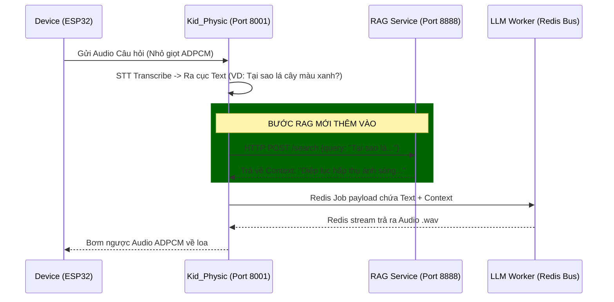

# BÍ KÍP TÍCH HỢP RAG VÀO PTALK KID PHYSIC

Tài liệu này hướng dẫn chi tiết cách để đưa Hệ thống Truy xuất Thông tin (RAG - Retrieval-Augmented Generation) vào thiết bị phần cứng Kid Physic mà không làm rườm rà hay phá vỡ kiến trúc siêu cấp mở rộng (Decoupled Architecture) hiện tại.

## 1. Trả lời câu hỏi: Có nên tách Database và Service Retrieve riêng?
Câu trả lời là: **CÓ! TUYỆT ĐỐI NÊN TÁCH RIÊNG HOÀN TOÀN.**

Vì sao?
1. **Bảo toàn quy trình Stateless:** Hiện tại cổng `kid_physic` (Port 8001) chỉ làm nhiệm vụ Gateway nhận/trả socket I/O. Nếu bạn nhồi code load mô hình Embedding (như PhoBERT, BGE-M3) hay setup VectorDB trực tiếp vào thư mục `kid_physic`, nó sẽ làm cái API Gateway này nặng nề, tốn RAM và khởi động chậm x10 lần.
2. **Khả năng dùng chung (Reusability):** Nếu bạn có 1 Service Retrieve độc lập (ví dụ cổng `8888`), sau này bạn có thể gọi RAG từ con App Mobile (Kids Port 8004) hay từ Website phân tích nội bộ đểu được hết mà không cần copy paste code.
3. **Mô hình kiến trúc Microservice chuẩn:**
   - VectorDB (Qdrant/Milvus) đứng độc lập quản lý ổ cứng.
   - 1 con Server FastAPI RAG (Làm nhiệm vụ: Chuyển câu hỏi -> Vector -> Query DB -> Rút ra Top 5 đoạn văn bản).
   - PTalk Kid Physic chỉ việc "Hỏi" nó qua HTTP Request cực nhẹ.

---

## 2. Kiến trúc Khuyến Nghị

Sơ đồ cách dữ liệu sẽ chảy sau khi bạn thêm RAG:



---

## 3. Các bước Implementing Code cụ thể

### Bước 1: Khởi động Đội hình RAG Server (Bên thứ 3)
Build 1 service Python FastAPI biệt lập thư mục `CloudPTalk`.
Nội dung của service này cực kì đơn giản: Nhận 1 chuỗi `string`, chọc vào Database Qdrant. Lấy ra text liên quan, gom thành 1 string bự và `return`.
Coi như con server này chạy ở `http://localhost:8888/retrieve`.

### Bước 2: Viết một Helper gọi RAG trong Kid Physic
Bạn tạo một file `kid_physic/rag_client.py` (Chỉ dùng thư viện rỗng tuếch như `requests` hoặc `aiohttp` để call API cho nhẹ).

```python
# kid_physic/rag_client.py
import aiohttp
import traceback

async def fetch_knowledge(query_text: str) -> str:
    """Gọi sang RAG Server độc lập để lấy kiến thức nền."""
    try:
        # Gọi sang con RAG Server mà bạn tự build
        url = "http://localhost:8888/retrieve" 
        async with aiohttp.ClientSession() as session:
            async with session.post(url, json={"query": query_text}, timeout=3.0) as response:
                if response.status == 200:
                    data = await response.json()
                    # data = {"context": "- Đoạn 1: ...\n- Đoạn 2: ..."}
                    return data.get("context", "")
    except Exception as e:
        print(f"⚠️ [RAG Warn] Lỗi gọi RAG, bypass... Lỗi: {e}")
    # RAG sập thì vẫn cho hệ thống chạy bình thường (LLM tự chém hoặc chat chay)
    return ""
```

### Bước 3: Đưa RAG vào đường ống Pipeline
Mở file `kid_physic/pipeline.py`. Hãy chèn ngầm logic ở đoạn **nằm giữa quy trình STT xong và bắt đầu đẩy Context sang kho LLM**.

```diff
# kid_physic/pipeline.py
+ from kid_physic.rag_client import fetch_knowledge

async def process(audio_input_path: str, session_id: str = "default") -> dict:
    ...
    # [1] CHỜ BƯỚC NÓI XONG STT
    stt_resp = await wait_for_result(req_id, expected_type="TEXT_DONE", timeout=cfg.PIPELINE_TIMEOUT)
    user_text = stt_resp.get("text", "")

+   # [2] 🔥 THÊM RAG Ở ĐÂY CHỈ VỚI 1 DÒNG CODE
+   rag_context = await fetch_knowledge(user_text)

    # [3] NHỒI DỮ LIỆU RAG VÀO PROMPT DÀNH CHO LLM
    from kid_physic.settings import SYSTEM_PROMPT, LLM_TEMPERATURE, ...
    
+   # Trộn RAG context vào Promt để LLM làm cơ sở chém gió
+   final_system_prompt = SYSTEM_PROMPT
+   if rag_context:
+       final_system_prompt += f"\n\n[KIẾN THỨC BỔ SUNG để tham khảo trả lời]:\n{rag_context}"

    llm_payload = {
        "text": user_text,
        "session_id": session_id,
        ...
        # Ghi đè tham số cho LLM Worker
-       "system_prompt": SYSTEM_PROMPT,
+       "system_prompt": final_system_prompt,
    }
    
    # Cuối cùng đẩy đi cho Worker xử lí trong bóng tối
    await xadd_json(get_redis(), "jobs:llm", llm_payload)
```

## 4. Ưu điểm Cốt tử của phương pháp này
Sử dụng kiến trúc Gọi Mở (như trên), bạn đạt được cảnh giới:
- **Tốc độ ánh sáng:** Nếu bạn không thích xài RAG nữa, hoặc Server RAG sập ➔ LLM vẫn chém gió theo trí tuệ gốc của nó. Hệ thống thiết bị nhúng của đứa bé Không Bị Chết Đứng!
- **Dễ bảo trì:** Khi Model PhoBERT hay BGE-M3 của hệ RAG lỗi thời, bạn chỉ vọc code phía bên Server `8888`, không phải đụng rụng 1 cọng lông của codebase ruột `CloudPTalk` này.
- **Microservices Tái Sử Dụng:** Bạn có thể build giao diện Web Admin bằng React gọi trực tiếp API vô con `8888` đó để cho giáo viên Up file/Add dữ liệu vào VectorDB luôn mà Server của Lisa chẳng hề dính líu gì!
